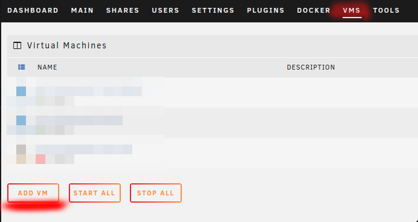
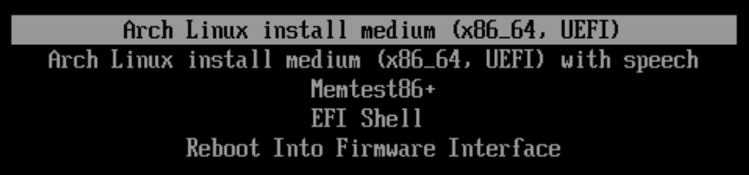

# Kubernetes on Arch Linux in Unraid VMs (or not)

&nbsp;

### Purpose
To help you quickly and painlessly launch a Kubernetes cluster in Unraid (or not) virtual machines. While this document specifically targets users running their virtual machines under Unraid, you can simply ignore the Unraid-specific instructions to make this work with other virtual machine setups.

&nbsp;

### You need
1) All the usual jazz, such as internet access, free time, etc.

2) `A host machine with virtualization support.` It is outside the scope of this document to discuss enabling virtualization support on your machine, but nearly all modern hardware supports it. It is likely an option in your BIOS, and it may or may not be enabled by default. I also recommend `a minimum of 16G of RAM`, and, frankly, `I'd prefer 32G+`.

3) Your choice of virtualizaton platform. This document is written against `Unraid version 6.9.2`, but adapting it to any other virtualization setup should be trivial.

4) This document.

&nbsp;

## Let's do this
[Step 1: obtain an Arch Linux ISO](#step-1-obtain-an-arch-linux-iso)

[Step 2: privision virtual machines](#step-2-provision-virtual-machines)

[Step 3: install Arch Linux](#step-3-install-arch-linux)

[Step 4: configure and launch your Kubernetes nodes](#step-4-configure-and-launch-your-kubernetes-nodes)

[Step 5: final test](#step-5-final-test)

&nbsp;

## Step 1: obtain an Arch Linux ISO

You can select an image from the main Arch download page at https://archlinux.org/download/. This guide was built using `archlinux-2022.02.01-x86_64.iso`, which can be found at http://mirror.rackspace.com/archlinux/iso/2022.02.01/. Direct download link: http://mirror.rackspace.com/archlinux/iso/2022.02.01/archlinux-2022.02.01-x86_64.iso

Place your downloaded ISO in the ISO share on your Unraid machine. By default, this is at `/mnt/user/isos/`.

&nbsp;

## Step 2: provision virtual machines

We are going to provision two machines, a control plane and a worker node.

> Provision the control plane

***Create an Arch Linux virtual machine***




&nbsp;

***Name the machine***

Select a name, and optionally fill in the description.


&nbsp;

***Provision CPUs and RAM***

Give the control plane at least `4GB` of RAM. If you can afford it, give it `8GB+`. The control plane, or master node, can become a bit resource-hungry, especially as the size of the ETCD store grows. I suggest that `initial memory and max memory should be the same`.

Give this machine `at least two CPU cores`, and `do not select CPU 0`. In my case, the machine hosting my Unraid setup only has four cores, but each core has two logical processing units, so I select both units of one core. Running `cat /proc/cpuinfo` from inside the virtual machine will show that the VM sees two processors.

In most cases, the other options in this section can be left at their default values.


&nbsp;

***Choose an ISO***

This tutorial uses archlinux-2022.02.01-x86_64.iso


&nbsp;

***Configure the virtual hard drive***

I suggest `no less than 16GB`. If you plan to use this as a "production" cluster and host apps on it for day-to-day use, I suggest `at least 64GB` of disk space for each node, including the control plane.


***Create the machine***

Leave "Start VM after creation" checked, and hit the "create" button.


Your virtual machine will launch, and you will be able to attach to it using the VNC client of your choice. If you are using Unraid, you will be able to use the built-in VNC client, which will run in your browser. You will find details in [Step 3: install Arch Linux](#step-3-install-arch-linux).

***The worker node***

Repeat [Step 2: provision a virtual machines](#step-2-provision-virtual-machines) to configure and launch a Kubernetes worker node to go with the control plane you just created. Suggested settings:

Name: `Arch Kubernetes Node0`

RAM: `2GB+`

CPUs: For worker nodes, you can get away with `one CPU core`, although I suggest `two cores` if you can spare them. `Do not use core 0` unless you have no choice. If possible, also do not use any of the cores you used for the control plane.

ISO: `archlinux-2022.02.01-x86_64.iso`. This is the image this tutorial is based on.

There are many other settings for creating virtual machines in Unraid, but for this tutorial, we've left all other settings at their default values.

&nbsp;

## Step 3: install Arch Linux

### `All of the steps in this section should be run on every machine you provision.` For the purposes of this tutorial, that means you will do all of this twice; once on the master node, and once on the worker node.

&nbsp;

> Connect to the virtual machine

If you are following along in Unraid, a VNC terminal will have been automatically opened in a new browser window. If you do not already have a VNC terminal open to the virual machine, see the following.

***Unraid***

`Click the Arch symbol` next to your virtual machine on your Unraid VMs page, then select `VNC Remote.`


&nbsp;

***Other VNC clients***

`Look for the "Graphics" heading` next to the chosen virtual machine on your `Unraid VMs page.` The `VNC:5900` in the image below means you can connect to the VNC server running on `port 5900` on `your Unraid box's IP address.`


&nbsp;

> Start the installation environment

You should now be looking at a screen similar to this.



Select `Arch Linux install medium` then press Enter. Wow! That was fast, wasn't it? That's because it didn't install anything. You are now in an ephemeral shell which provides the tools and data files you need to create your own installation. There is no wizard or guided setup, here. My screenshotting finger is getting sore, so expect a lot of text from here on out.

&nbsp;

> Create the necessary disk partitions.

We are only going to create two partitions; `/boot` and `/home`. We will not be creating a `swap` partition, as we will not be enabling swap.

***Find your virtual hard drive***

```
lsblk
```

```
root@archiso ~ # lsblk

NAME  MAJ:MIN RM   SIZE RO TYPE MOUNTPOINTS
loop0   7:0    0 657.4M  1 loop /run/archiso/airootfs
sr0    11:0    1 812.3M  0 rom  /run/archiso/bootmnt
vda   254:0    0    64G  0 disk 
```

You are looking for a device that is the same size as the disk you provisioned in step 2, and which has no mount point. In my case, it is `vda`.

***Partition the drive***

```
fdisk /dev/vda
```

```
Welcome to fdisk (util-linux 2.37.3).
Changes will remain in memory only, until you decide to write them.
Be careful before using the write command.

Device does not contain a recognized partition table.
Created a new DOS disklabel with disk identifier 0x8ee4f3ad.

Command (m for help):
```

Enter `n` for new.

```
Command (m for help): n

Partition type
   p   primary (0 primary, 0 extended, 4 free)
   e   extended (container for logical partitions)
Select (default p): 
```

Select `p` for primary, then `1` to create partition #1 for this drive. Accept the default, `2048` in my case, for the first sector, and enter `+512M` for the size.

```
Select (default p): p

Partition number (1-4, default 1): 1
First sector (2048-134217727, default 2048): 
Last sector, +/-sectors or +/-size{K,M,G,T,P} (2048-134217727, default 134217727): +512M

Created a new partition 1 of type 'Linux' and of size 512 MiB.

Command (m for help): 
```

Enter `t` to set the partition type for partition #1. Set the partition type to `EFI`. For the version of fdisk included with the Arch Linux installation ISO used by this tutorial, the alias for the EFI partition type is `ef`. If you have any doubts, you can enter `L` to see a list of available partition types. You are looking for something similar to `EFI (FAT-12/16/32)`.

```
Command (m for help): t

Selected partition 1
Hex code or alias (type L to list all): ef
Changed type of partition 'Linux' to 'EFI (FAT-12/16/32)'.

Command (m for help): 
```


Enter `n` again to create a new partition. Once again select `p` for primary. Set the partition number to `2`, and accept the defaults for both `first sector` and `last sector`. This will cause partition #2 to fill all remaining space on the drive.

```
Command (m for help): n

Partition type
   p   primary (1 primary, 0 extended, 3 free)
   e   extended (container for logical partitions)
Select (default p): 

Using default response p.
Partition number (2-4, default 2): 
First sector (1050624-134217727, default 1050624): 
Last sector, +/-sectors or +/-size{K,M,G,T,P} (1050624-134217727, default 134217727): 

Created a new partition 2 of type 'Linux' and of size 63.5 GiB.

Command (m for help): 
```

Now enter `w` to write the new partition table to the disk. `This will destroy existing data on the disk`. If you're following the steps in this guide, that won't be an issue, but you should be aware of the danger.

```
Command (m for help): w

The partition table has been altered.
Calling ioctl() to re-read partition table.
Syncing disks.

root@archiso ~ # 
```

You should now see your new partitions when you run `lsblk`.

```
lsblk
```

```
root@archiso ~ # lsblk

NAME   MAJ:MIN RM   SIZE RO TYPE MOUNTPOINTS
loop0    7:0    0 657.4M  1 loop /run/archiso/airootfs
sr0     11:0    1 812.3M  0 rom  /run/archiso/bootmnt
vda    254:0    0    64G  0 disk 
├─vda1 254:1    0   512M  0 part 
└─vda2 254:2    0  63.5G  0 part 
```

&nbsp;

> Create file systems

Create a `FAT32` file system for the EFI boot partition.

```
mkfs.vfat -F32 /dev/vda1
```

```
root@archiso ~ # mkfs.vfat -F32 /dev/vda1

mkfs.fat 4.2 (2021-01-31)
```

Create an `EXT4` file system for the root partition.

```
mkfs.ext4 /dev/vda2
```

```
root@archiso ~ # mkfs.ext4 /dev/vda2

mke2fs 1.46.5 (30-Dec-2021)
Discarding device blocks: done                            
Creating filesystem with 16645888 4k blocks and 4161536 inodes
Filesystem UUID: 4aa42f11-2bd8-4a32-ae99-52c1ebad7e4d
Superblock backups stored on blocks: 
	32768, 98304, 163840, 229376, 294912, 819200, 884736, 1605632, 2654208, 
	4096000, 7962624, 11239424

Allocating group tables: done                            
Writing inode tables: done                            
Creating journal (65536 blocks): done
Writing superblocks and filesystem accounting information: done
```

&nbsp;

> Install packages

***Verify network connectivity***

Your virtual ethernet adapter should already be configured, assigned an IP address, and ready to go. In my case, it is `enp1s0` as shown below in the output from `ip addr`.

```
ip addr
```

```
root@archiso ~ # ip addr

1: lo: <LOOPBACK,UP,LOWER_UP> mtu 65536 qdisc noqueue state UNKNOWN group default qlen 1000
    link/loopback 00:00:00:00:00:00 brd 00:00:00:00:00:00
    inet 127.0.0.1/8 scope host lo
       valid_lft forever preferred_lft forever
    inet6 ::1/128 scope host 
       valid_lft forever preferred_lft forever
2: enp1s0: <BROADCAST,MULTICAST,UP,LOWER_UP> mtu 1500 qdisc fq_codel state UP group default qlen 1000
    link/ether 52:54:00:5b:96:d3 brd ff:ff:ff:ff:ff:ff
    inet 192.168.0.15/24 metric 100 brd 192.168.0.255 scope global dynamic enp1s0
       valid_lft 81623sec preferred_lft 81623sec
    inet6 fe80::5054:ff:fe5b:96d3/64 scope link 
       valid_lft forever preferred_lft forever
```

Ping a known hose to verify network connectivity.

```
ping google.com
```

```
root@archiso ~ # ping google.com

PING google.com (142.250.190.78) 56(84) bytes of data.
64 bytes from ord37s34-in-f14.1e100.net (142.250.190.78): icmp_seq=1 ttl=114 time=20.2 ms
64 bytes from ord37s34-in-f14.1e100.net (142.250.190.78): icmp_seq=2 ttl=114 time=14.7 ms
64 bytes from ord37s34-in-f14.1e100.net (142.250.190.78): icmp_seq=3 ttl=114 time=19.9 ms
64 bytes from ord37s34-in-f14.1e100.net (142.250.190.78): icmp_seq=4 ttl=114 time=15.7 ms
```

Troubleshooting networking issues is outside the scope of this document, but you will need a working Internet connection to proceed with the rest of this guide.

***Update available package list***

The package manager used in Arch Linux is `pacman`. It is similar to `apt` or `yum`, but with its own syntax. Start by updating the available packages.

```
pacman -Sy
```

The `S` means `synchronize`, and it is the basic command used when you want pacman to fetch data. The `y` tells pacman you want to refresh the list of available packages. You could add a second `y` to the command to force pacman to update the package list even if it believes you are already up-to-date.

Backup your pacman mirror list. That way, you can restore it if something goes wrong in the following step.

```
cp /etc/pacman.d/mirrorlist /etc/pacman.d/mirrorlist.bak
```

***(Optional) Install and run `reflector`.***

Reflector is a python script which can help you find the fastest mirrors to use when installing packages with pacman.

```
pacman -S reflector
```

```
root@archiso ~ # pacman -S reflector

resolving dependencies...
looking for conflicting packages...

Packages (1) reflector-2021.11-3

Total Installed Size:  0.10 MiB
Net Upgrade Size:      0.00 MiB

:: Proceed with installation? [Y/n] y
```

```
reflector -c "US" -f 8 -l 16 --save /etc/pacman.d/mirrorlist
```

This command means roughly, "Look at the sixteen most recently updated mirrors located in the US, and save the fastest eight of those to /etc/pacman.d/mirrorlist."

***Mount the root partition***

You need somewhere to put all the files we're about to download. Mount the large partition we created earlier in this step to `/mnt`.

```
mount /dev/vda2 /mnt
```

***Install the base system and some helpful packages***

We don't want to install the following packages to the ephemeral RAM disk where our current Arch installation environment lives, so we use `pacstrap` to tell pacman to put the files somewhere else. In this case, in `/mnt`, where we have mounted the root file system for the Arch install we are currently building.
```
pacstrap /mnt base docker kubeadm kubectl kubelet linux linux-firmware nano openssh sudo vim
```
`base`: Installs many of the things people think of when they think of Linux, such as the `bash` shell, `grep`, `sed`, `tar`, and so on.

`docker`: The container runtime used to by Kubernetes to manage containers. Another popular choice is `containerd`.

`kubeadm`: Tool for easily bootstrapping Kubernetes clusters.

`kubectl`: Command-line tool for administering Kubernetes clusters.

`kubelet`: The Kubernetes workhorse service.

`linux`: Installs the Linux kernel and kernel modules.

`linux-firmware`: Installs many firmware packages needed for the operation of a wide variety of hardware items that may be attached to your system.

`nano` and `vim`: These are two common text editors used in Linux environments. You can leave one or both off and replace them with whichever editor(s) you prefer.

`openssh`: Daemon to allow incoming SSH connections to the virtual machine.

`sudo`: Allows non-root users to perform root operations.


&nbsp;

> Configure root file system

***Generate an fstab file to load your root disk on boot***

```
genfstab -U /mnt >> /mnt/etc/fstab
```

This command means, "Look for all file systems mounted under /mnt and add them to /mnt/etc/fstab using the device UUIDs." The UUID portion is useful because it means `mount` will always be able to find your devices, even if they are moved around on the bus. For instance, if `vda` became `vdd`, mount would still be able to find it and mount it properly based on its UUID.

&nbsp;

> Chroot to new root file system

```
arch-chroot /mnt
```

This makes `/mnt` the new root of our system. The `arch-chroot` command adds some helpful functionality to the normal Linux `chroot`, such as taking care of creating `/proc` and `/dev` mounts for your new system root. From now on, as far as any commands you run are concerned, the files and directories under `/mnt` are your entire system.

&nbsp;

> Configure locale and time zone

***Set your locale***

```
vim /etc/locale.gen
```

```
[root@archiso /]# vim /etc/locale.gen
```

Look for the locale(s) you wish to use.

```
...
#en_SG ISO-8859-1
en_US.UTF-8 UTF-8
#en_US ISO-8859-1
#en_ZA.UTF-8 UTF-8
...
```

Uncomment any locales you want your system to support. In my case, that is only `en_US.UTF-8`, so I remove the `#` sign from that line. Next, run `locale-gen` to set up your system locale(s).

```
locale-gen
echo LANG=en_US.UTF-8 | tee -a /etc/locale.conf
```

```
[root@archiso /]# locale-gen
                   echo LANG=en_US.UTF-8 | tee -a /etc/locale.conf
Generating locales...
  en_US.UTF-8... done
Generation complete.
LANG=en_US.UTF-8
```

***Set your time zone***

Set your time zone using `timedatectl`.

```
timedatectl set-timezone America/New_York
```

If you don't know which time zone you are in, you can use `timedatectl list-timezones` to get a complete list of available options.

&nbsp;

> Name your machine

I like `arch-kubernetes-master` for the master node, and `arch-kubernetes-node0` for the first worker node, so I will use those. You do not have to follow my naming convention, but these are the names I will use to refer to the Kubernetes machines going forward.

```
echo arch-kubernetes-master > /etc/hostname
```

```
vim /etc/hosts
```

Add host entries

```
127.0.0.1	localhost	arch-kubernetes-master
::1		    localhost
```

Remember to change the hostname in the previous steps when you are deploying the worker node.

&nbsp;

> Configure networking

***(Recommended) Set static IP address***

Identify your virtual ehternet adapter using the method found in Step 3 : Install packages : Verify network connectivity. In my case, my virtual NIC is `enp1s0` and my IP address is `192.168.0.15`.

Give your virtual NIC an address. You will not be able to use the address that is alredy assigned to the card. I chose `192.168.0.40/24`. The `/24` is a netmask which tells the NIC that it is responsible for traffic in the range of `192.168.0.0 - 192.168.0.255`.

***Create the network file***

```
vim /etc/systemd/network/enp1s0.network
```

***Add these lines to the file, adjusting for your system***

```
[Match]
Name=enp1s0

[Network]
Address=192.168.0.40/24
Gateway=192.168.0.1
DNS=8.8.8.8
DNS=8.8.4.4
```

The `Address` and `Gateway` values will depend on your particular network setup, but the `192.168.x.y` values used, above, will most often work.

The `DNS` entries above point to Google's DNS servers. You may use any DNS servers you like.

***Enable networkd***

```
systemctl enable systemd-networkd
```

```
[root@archiso /]# systemctl enable systemd-networkd

Created symlink /etc/systemd/system/dbus-org.freedesktop.network1.service → /usr/lib/systemd/system/systemd-networkd.service.
Created symlink /etc/systemd/system/multi-user.target.wants/systemd-networkd.service → /usr/lib/systemd/system/systemd-networkd.service.
Created symlink /etc/systemd/system/sockets.target.wants/systemd-networkd.socket → /usr/lib/systemd/system/systemd-networkd.socket.
Created symlink /etc/systemd/system/sysinit.target.wants/systemd-network-generator.service → /usr/lib/systemd/system/systemd-network-generator.service.
Created symlink /etc/systemd/system/network-online.target.wants/systemd-networkd-wait-online.service → /usr/lib/systemd/system/systemd-networkd-wait-online.service.
```

***Enable `systemd-resolved`***

```
systemctl enable systemd-resolved
```

```
[root@archiso /]# systemctl enable systemd-resolved

Created symlink /etc/systemd/system/dbus-org.freedesktop.resolve1.service → /usr/lib/systemd/system/systemd-resolved.service.
Created symlink /etc/systemd/system/multi-user.target.wants/systemd-resolved.service → /usr/lib/systemd/system/systemd-resolved.service.
```

This step is necessary for the system to use the DNS entries we specified in `enp1s0.network`.


***Enable sshd***

This daemon was installed as part of the `pacstrap` operation earlier in this section.

```
systemctl enable sshd
```

```
[root@archiso /]# systemctl enable sshd

Created symlink /etc/systemd/system/multi-user.target.wants/sshd.service → /usr/lib/systemd/system/sshd.service.
```

***(Optional) Enable DHCP***

`I would discourage you from using DHCP for your master node.` Your Kubernetes life will be easier if the master node is always in the same place.

Install the `dhcpcd` package.

```
pacman -S dhcpcd
```

```
[root@archiso /]# pacman -S dhcpcd

resolving dependencies...
looking for conflicting packages...

Packages (1) dhcpcd-9.4.1-1

Total Download Size:   0.20 MiB
Total Installed Size:  0.47 MiB

:: Proceed with installation? [Y/n] y
```

Enable the `dhcpcd` service.

```
systemctl enable dhcpcd
```

```
[root@archiso /]# systemctl enable dhcpcd
Created symlink /etc/systemd/system/multi-user.target.wants/dhcpcd.service → /usr/lib/systemd/system/dhcpcd.service.
```

This command tells your system to start the dhcpcd daemon whenever the system starts. You shouldn't need to start the dhcpcd service for your current session, because the Arch install environment should have configured your virtual NIC for use during the installation process.

***Enable br_netfilter***

The br_netfilter kernel module enables functionality that enhances bidged networking and allows Kubernetes pods to believe they are connected directly to external networks.

Create the module load file

```
echo br_netfilter | tee -a /etc/modules-load.d/br_netfilter.conf
```

```
[root@archiso /]# echo br_netfilter | tee -a /etc/modules-load.d/br_netfilter.conf

br_netfilter
```


&nbsp;

> Prepare your system for booting

**Install the bootloader.**

```
pacman -S efibootmgr grub
```

```
[root@archiso /]# pacman -S efibootmgr grub

resolving dependencies...
looking for conflicting packages...

Packages (3) efivar-38-2  efibootmgr-17-2  grub-2:2.06-4

Total Download Size:    6.91 MiB
Total Installed Size:  34.73 MiB

:: Proceed with installation? [Y/n] y
```

**Create a mount point for the `/boot` partition.**

```
mkdir /boot/efi
```

**Mount your boot partition the the new mount point.**

```
mount /dev/vda1 /boot/efi
```

**Install Grub**

```
grub-install --target=x86_64-efi --bootloader-id=GRUB --efi-directory=/boot/efi
```

```
[root@archiso /]# grub-install --target=x86_64-efi --bootloader-id=GRUB --efi-directory=/boot/efi

Installing for x86_64-efi platform.
Installation finished. No error reported.
```

This assumes you are installing Arch on an `x86_64` virtual machine. For a list of targets, run

```
grub-install --help         
```

```
[root@archiso /]# grub-install --help         

...
--target=TARGET        install GRUB for TARGET platform
                    [default=x86_64-efi]; available targets:
                    arm-coreboot, arm-efi, arm-uboot, arm64-efi,
                    i386-coreboot, i386-efi, i386-ieee1275,
                    i386-multiboot, i386-pc, i386-qemu, i386-xen,
                    i386-xen_pvh, ia64-efi, mips-arc, mips-qemu_mips,
                    mipsel-arc, mipsel-loongson, mipsel-qemu_mips,
                    powerpc-ieee1275, riscv32-efi, riscv64-efi,
                    sparc64-ieee1275, x86_64-efi, x86_64-xen
...
```

***Generate grub.cfg***

```
grub-mkconfig -o /boot/grub/grub.cfg
```

```
[root@archiso /]# grub-mkconfig -o /boot/grub/grub.cfg

Generating grub configuration file ...
Found linux image: /boot/vmlinuz-linux
Found initrd image: /boot/initramfs-linux.img
Found fallback initrd image(s) in /boot:  initramfs-linux-fallback.img
Warning: os-prober will not be executed to detect other bootable partitions.
Systems on them will not be added to the GRUB boot configuration.
Check GRUB_DISABLE_OS_PROBER documentation entry.
Adding boot menu entry for UEFI Firmware Settings ...
done
```

This will generate a grub config file with all of the systems grub was able to find, which will be available in the boot menu next time you boot from this drive.

&nbsp;

> Create a non-root user

By default, `sshd does not allow the root user to login via ssh`. By creating this user, we make it possible to log in via ssh without reconfiguring sshd. In addition, it is generally considered good practice to use a user other than root for day-to-day usage of a Linux machine.

***Create a new user***

```
useradd -mU -G wheel,docker kubeuser
```

This command creates a user named `kubeuser`, copies over the default user directory files (.bash_profile, etc), creates a group with the same name as the user and assigns that as the user's primary group, and adds the user to the supplmentary groups `wheel` and `docker`.

`wheel`: Will allow the user to perform root-level operations once we have configured sudo.

`docker`: Will allow the user to manage docker containers.

***Assign a password to the new user***

```
passwd kubeuser
```

```
[root@archiso /]# passwd kubeuser

New password: 
Retype new password: 
passwd: password updated successfully
```

***Give the new user `sudo` permissions***

```
visudo
```

The `visudo` program allows you to make changes the the normally read-only `/etc/sudoers` file. By default, it uses `vim` for editing. If you are more comfortable with another editor, such as `nano`, you can specify such an editor on the command-line.

```
EDITOR=nano visudo
```

Find these lines, and edit them to uncomment the line that starts with `# %wheel`.

```
## Uncomment to allow members of group wheel to execute any command
# %wheel ALL=(ALL:ALL) ALL
```

This will allow members of the `wheel` group to perform root-level operations.


&nbsp;

> Enable the Docker daemon

```
systemctl enable docker
```

```
[root@archiso /]# systemctl enable docker

Created symlink /etc/systemd/system/multi-user.target.wants/docker.service → /usr/lib/systemd/system/docker.service.
```

&nbsp;

> Reboot

```
exit
```

```
reboot
```

```
[root@archiso /]# exit
exit
root@archiso ~ # reboot
```


&nbsp;

## Step 4: Configure and launch your Kubernetes nodes

This is not [Kubernetes the Hard Way](https://github.com/kelseyhightower/kubernetes-the-hard-way). We are not going to go through all of the steps for generating our own security certificates, provisioning various IP ranges, and so on. Rather, we are going to use [Kubeadm](https://kubernetes.io/docs/setup/production-environment/tools/kubeadm/install-kubeadm/), which abstracts all of the fiddly bits about bootstrapping a Kubernetes cluster, and lets us get up and running with the minimum of hassle.

If you followed the `configure networking` steps in the previous section, you should be good to go. Otherwise, you will need to configure your system for Internet connectivity before continuing.

The `docker`, `kubeadm`, and `kubelet` packages should have all been installed during [Step 3: install Arch Linux](#step-3-install-arch-linux). If not, please follow the instructions in that section to install and enable these packages.

### `The following steps apply to both the master node and the worker node`

***Adjust the kubelet's cni bin directory***

```
sudo vim /etc/kubernetes/kubelet.env 
```

Change

```
KUBELET_ARGS=--cni-bin-dir=/usr/lib/cni
```

to read

```
KUBELET_ARGS=--cni-bin-dir=/opt/cni/bin
```

***Reload the daemon files***
```
sudo systemctl daemon-reload
```

***Enable the kubelet service***

```
sudo systemctl enable kubelet
```

> Configure the master, or controlplane, node

***Initialize the cluster***

Execute the following command on the master node. Details about the kubeadm options used are available in [the Kubeadm documentation](https://kubernetes.io/docs/reference/setup-tools/kubeadm/kubeadm-init/).

```
sudo kubeadm init --apiserver-advertise-address=192.168.0.40 --control-plane-endpoint=192.168.0.40 --node-name=arch-kubernetes-master --upload-certs --dry-run
```

If everything looks good, you can remove `--dry-run` from the above command, and run it again to set up the master node for real. If you receive an error similar to `error execution phase upload-certs: error uploading certs: error to get token reference: secrets "secret not found" not found` during the `--dry-run`, you can safely ignore it.

After running `kubeadm init`, you should see something like this at the end of the output.

```
kubeadm join 192.168.0.40:6443 --token kkcvxm.vzc4x00qnz4inkit \
	--discovery-token-ca-cert-hash sha256:6e823395c08caef2e67a9a0e9102c5b9390a3cbea0940db7726a3286e67b929e
```

Save that somewhere. We will be using it to join the worker node to the cluster.


***Set up your kubectl environment***

Kubeadm will have created a kubeconfig file at `/etc/kubernetes/admin.conf`. This file contains information necessary to administer the cluster using the `kubectl` tool. There are numerous ways you can set up your environment to allow `kubectl` to work. We are not deploying a secure or mission-critical environment, here, so we are going to go with the quick and easy solution of simply copying admin.conf to our home directory, and setting up our environment to tell `kubectl` where to find the new copy.

```
mkdir ~/.kubernetes
sudo cp /etc/kubernetes/admin.conf ~/.kubernetes/kubeconfig
sudo chown kubeuser:kubeuser ~/.kubernetes/kubeconfig
echo export KUBECONFIG=$HOME/.kubernetes/kubeconfig | tee -a ~/.bashrc 
export KUBECONFIG=/home/kubeuser/.kubernetes/kubeconfig
source ~/.bashrc 
```

***Install a pod networking solution***

I have chosen Weave-Net for this tutorial because it is painless and has all the networking features most clusters will need, such as support for NetworkPolicies.

```
kubectl apply -f "https://cloud.weave.works/k8s/net?k8s-version=$(kubectl version | base64 | tr -d '\n')"
```

See [the Weave-Net documentation](https://www.weave.works/docs/net/latest/kubernetes/kube-addon/) for more information.


***Test the master node***

```
kubectl get nodes
```

```
[kubeuser@arch-kubernetes-master ~]$ kubectl get nodes

NAME                     STATUS   ROLES                  AGE   VERSION
arch-kubernetes-master   Ready    control-plane,master   59m   v1.23.4
```

The `ready` status indicates that everything went well.

&nbsp;

> Join the worker node to the cluster

Take the output you saved from the `kubeadmin init` command and run it on the worker node under `sudo`.

```
sudo kubeadm join 192.168.0.40:6443 --token jvjmu7.6fr7zxj3ahnel2zx \
	--discovery-token-ca-cert-hash sha256:cb5890725c79ebeb944d048187567dc5df411b6085f49546576ace55a119f655
```

```
[kubeuser@arch-kubernetes-node0 ~]$ sudo kubeadm join 192.168.0.40:6443 --token jvjmu7.6fr7zxj3ahnel2zx    --discovery-token-ca-cert-hash sha256:cb5890725c79ebeb944d048187567dc5df411b6085f49546576ace55a119f655


[sudo] password for kubeuser: 
[preflight] Running pre-flight checks
[preflight] Reading configuration from the cluster...
[preflight] FYI: You can look at this config file with 'kubectl -n kube-system get cm kubeadm-config -o yaml'
[kubelet-start] Writing kubelet configuration to file "/var/lib/kubelet/config.yaml"
[kubelet-start] Writing kubelet environment file with flags to file "/var/lib/kubelet/kubeadm-flags.env"
[kubelet-start] Starting the kubelet
[kubelet-start] Waiting for the kubelet to perform the TLS Bootstrap...

This node has joined the cluster:
* Certificate signing request was sent to apiserver and a response was received.
* The Kubelet was informed of the new secure connection details.

Run 'kubectl get nodes' on the control-plane to see this node join the cluster.
```

If your node has successfully joined the cluster, proceed to step #5. If you encountered an error, please look over the guide to see if you missed or received unexpected results from any of the previous steps.

&nbsp;

## Step 5: Final test

`Execute these commands from the control plane.`

***Check your nodes***

```
kubectl get nodes
```

```
[kubeuser@arch-kubernetes-master ~]$ kubectl get nodes
NAME                     STATUS   ROLES                  AGE   VERSION
arch-kubernetes-master   Ready    control-plane,master   46m   v1.23.4
arch-kubernetes-node0    Ready    <none>                 46m   v1.23.4
```

You should see both the master and the worker in the "Ready" state.

***Create a simple pod***

```
kubectl run test-pod --image=busybox -- sleep 1024
```

```
[kubeuser@arch-kubernetes-master ~]$ kubectl run test-pod --image=busybox -- sleep 1024

pod/test-pod created
```

***Check status of new pod***

```
kubectl get pods
```

```
[kubeuser@arch-kubernetes-master ~]$ kubectl get pods

NAME       READY   STATUS    RESTARTS   AGE
test-pod   1/1     Running   0          11s
```

If all looks well, continue to [step #6](#step-6-a-round-of-high-fives).

&nbsp;

## Step 6: a round of high-fives

You've earned it.

&nbsp;

### Helpful links

https://itsfoss.com/install-arch-linux/, an easy-to-follow guide to setting up Arch Linux.

https://kubernetes.io/docs/home/, the official Kubernetes documentation.

https://github.com/kelseyhightower/kubernetes-the-hard-way, Kubernetes the Hard Way.

https://wiki.archlinux.org/, Arch Linux Wiki.